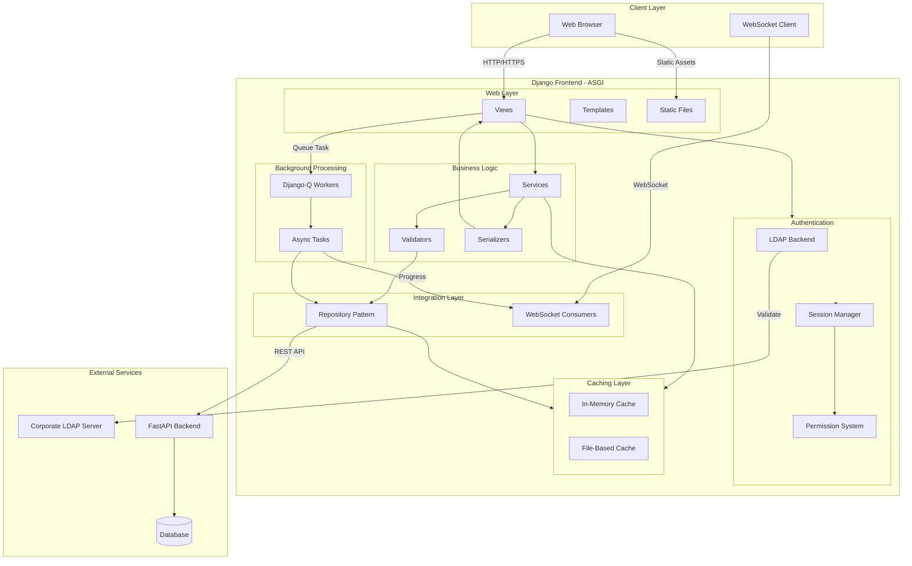
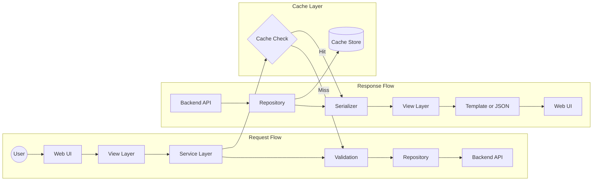
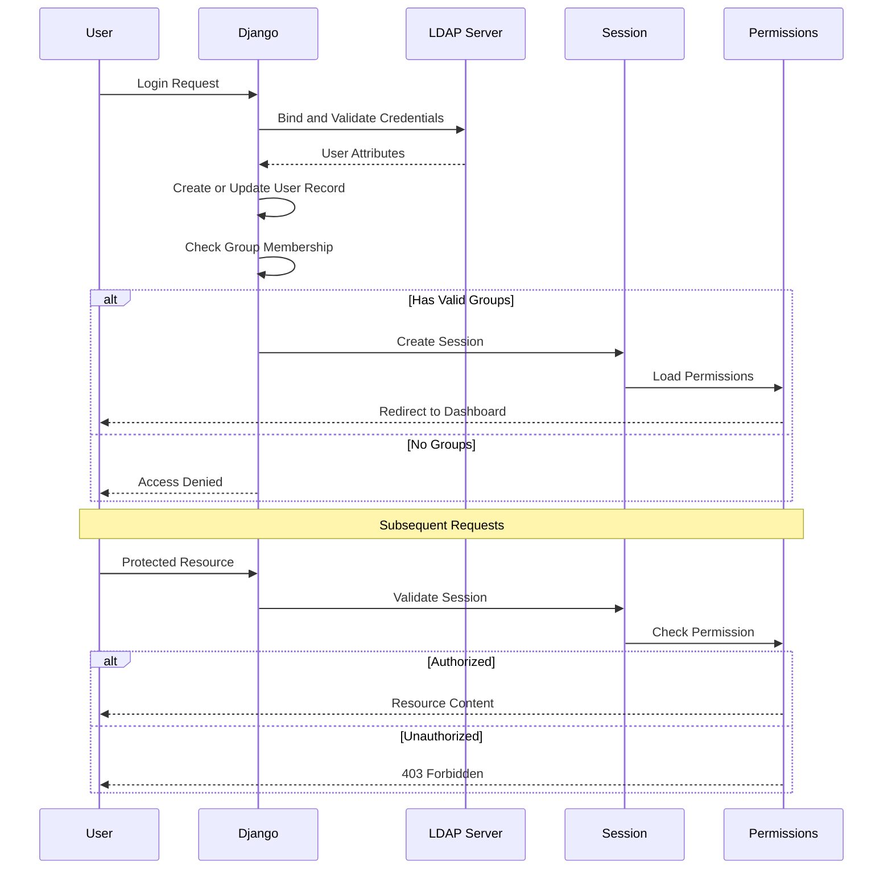
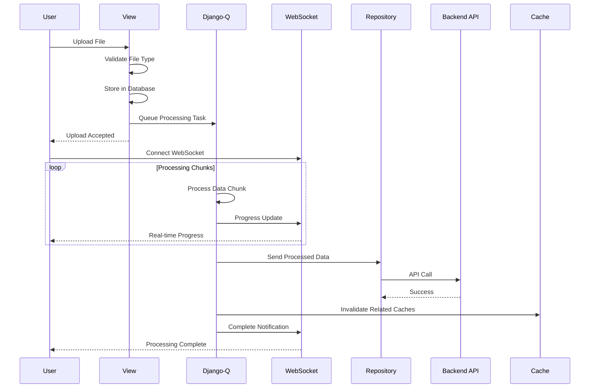
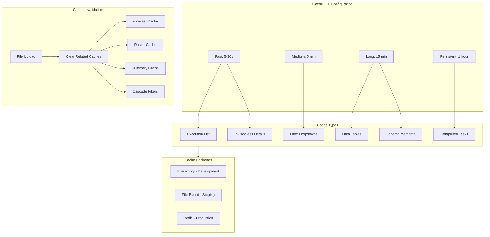
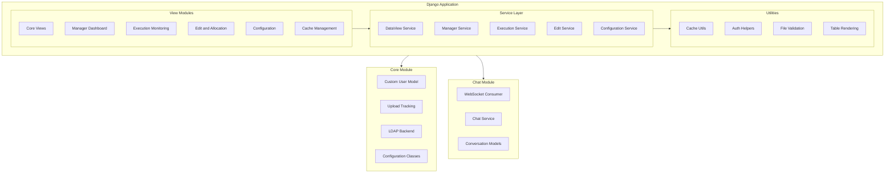
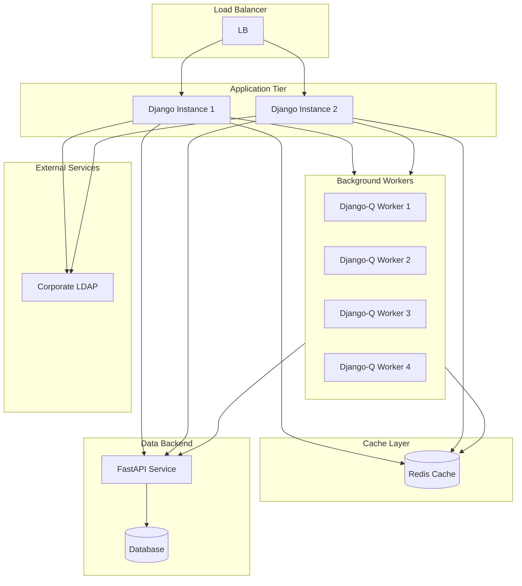
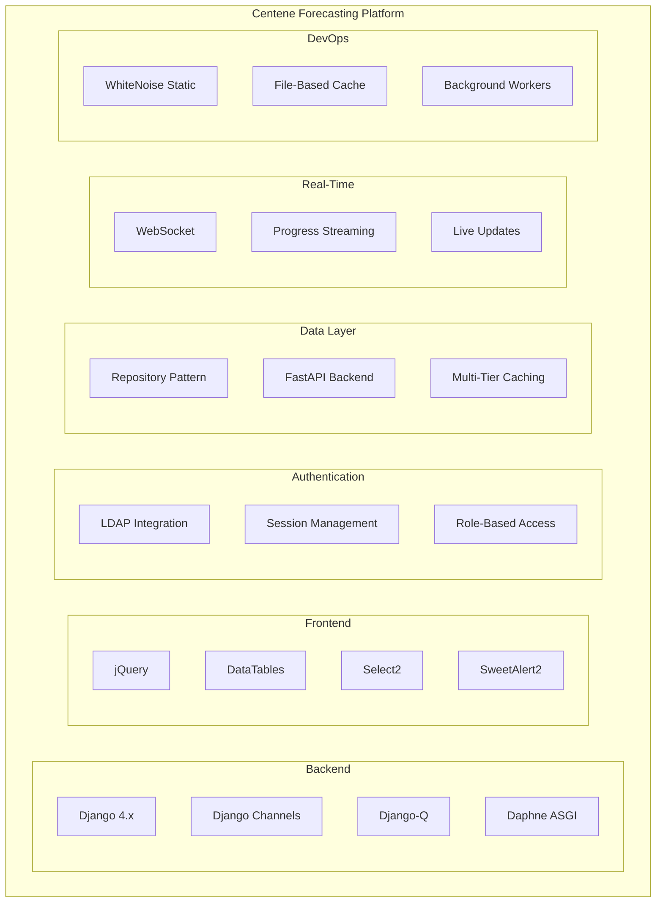

# Centene Forecasting - Technical Architecture

> **Testing**: Open `docs/diagrams/test_diagrams.html` in a browser to validate all diagrams render correctly.

---

## 1. High-Level System Architecture

---

## 2. Data Flow Architecture

---

## 3. Authentication and Authorization Flow

---

## 4. File Upload and Background Processing

---

## 5. Caching Strategy

---

## 6. Component Architecture

---

## 7. Deployment Architecture

---

## 8. Technology Stack

---

## Key Design Patterns

| Pattern | Usage |
|---------|-------|
| **Repository** | APIClient abstracts all backend communication |
| **Layered Architecture** | Views - Services - Validators - Repository |
| **Decorator-Based Caching** | cache_with_ttl on expensive operations |
| **Configuration Classes** | Centralized validated business configuration |
| **Middleware Pipeline** | Authentication - Session - Permissions |
| **Async Processing** | Django-Q for long-running tasks |
| **Real-Time Updates** | WebSocket for progress streaming |
| **Retry Strategy** | Exponential backoff on API failures |

---

## Security Measures

- **Authentication**: Corporate LDAP integration
- **Authorization**: Role-based permission system (Admin, Manager, Viewer)
- **Session Management**: Django session framework with secure cookies
- **CSRF Protection**: Django middleware enabled
- **File Validation**: Type checking before processing
- **Input Validation**: Dedicated validator layer
- **Error Handling**: Custom middleware for graceful failures
