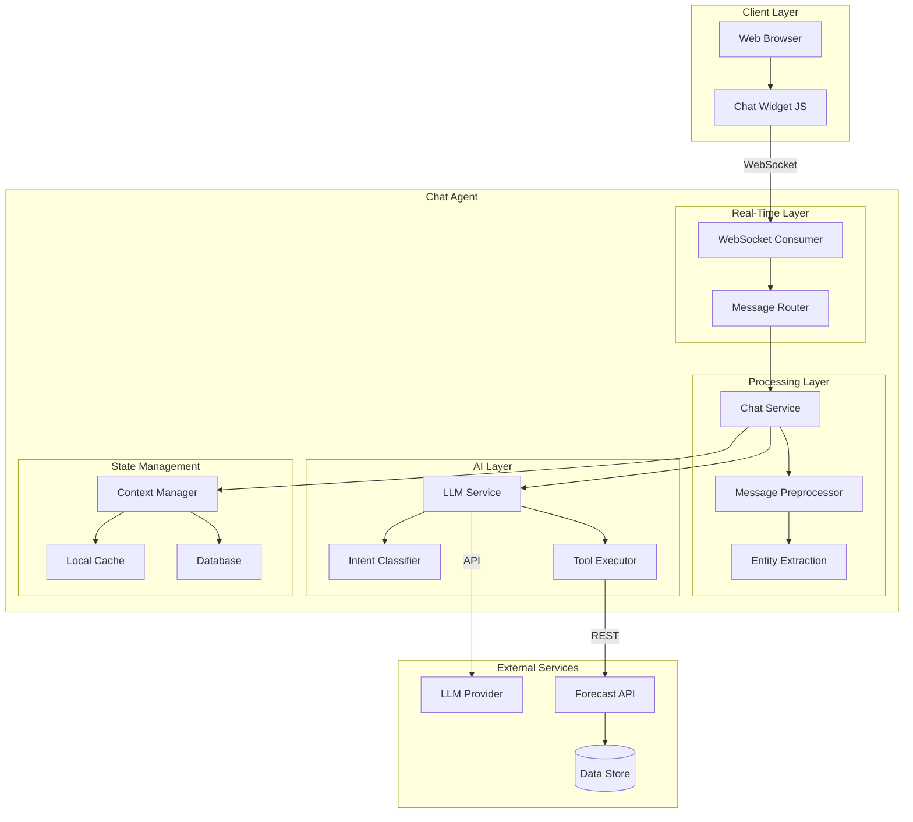
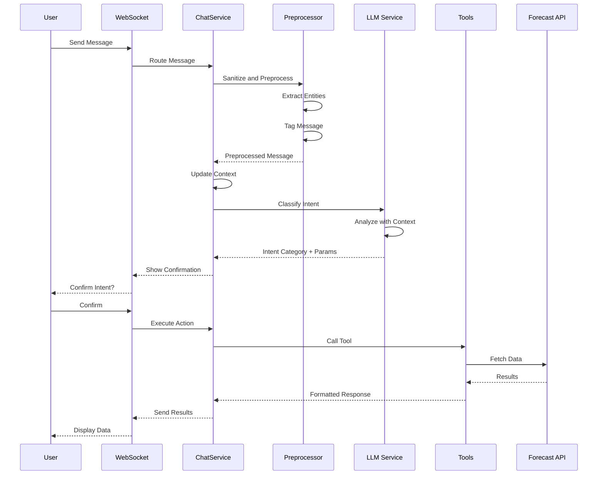
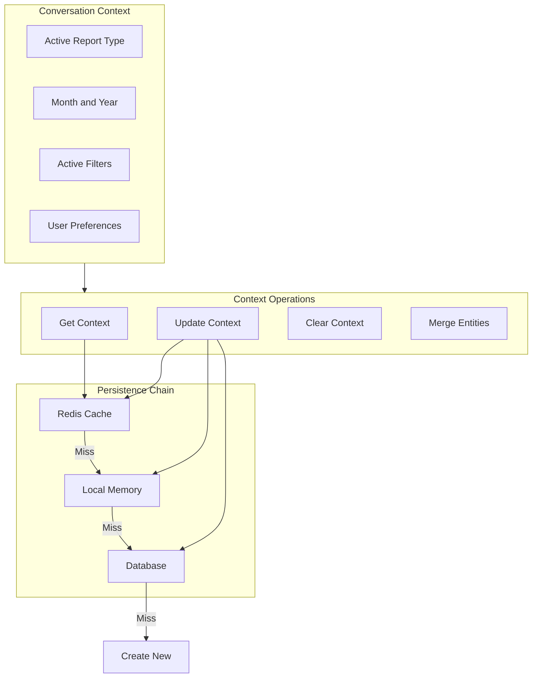
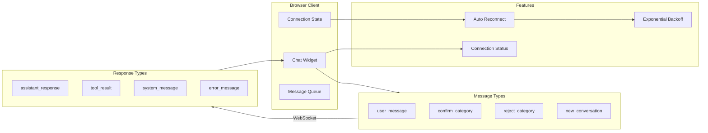
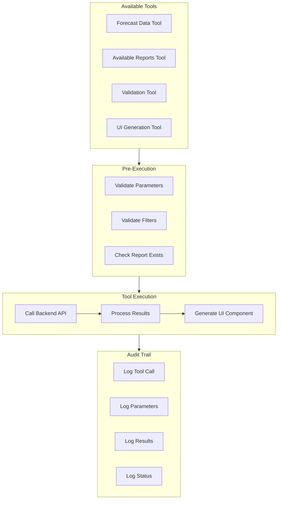
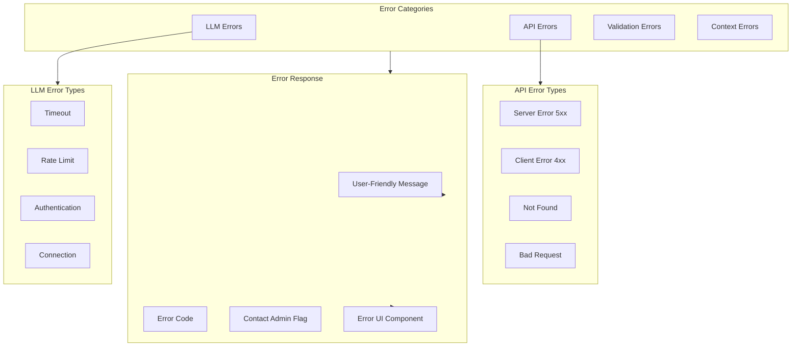
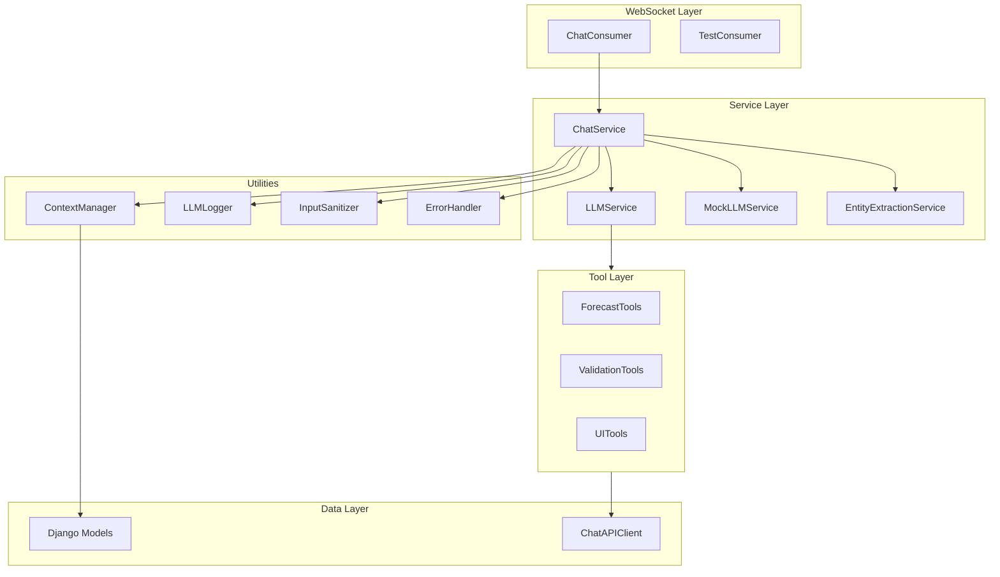
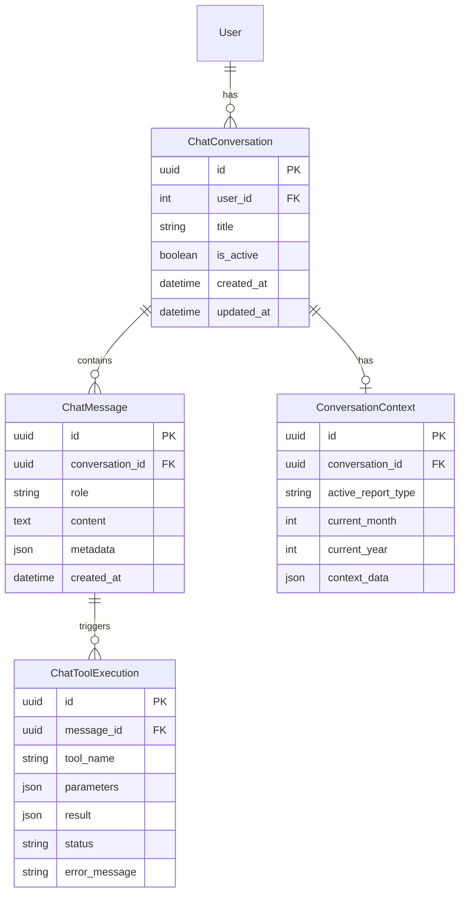
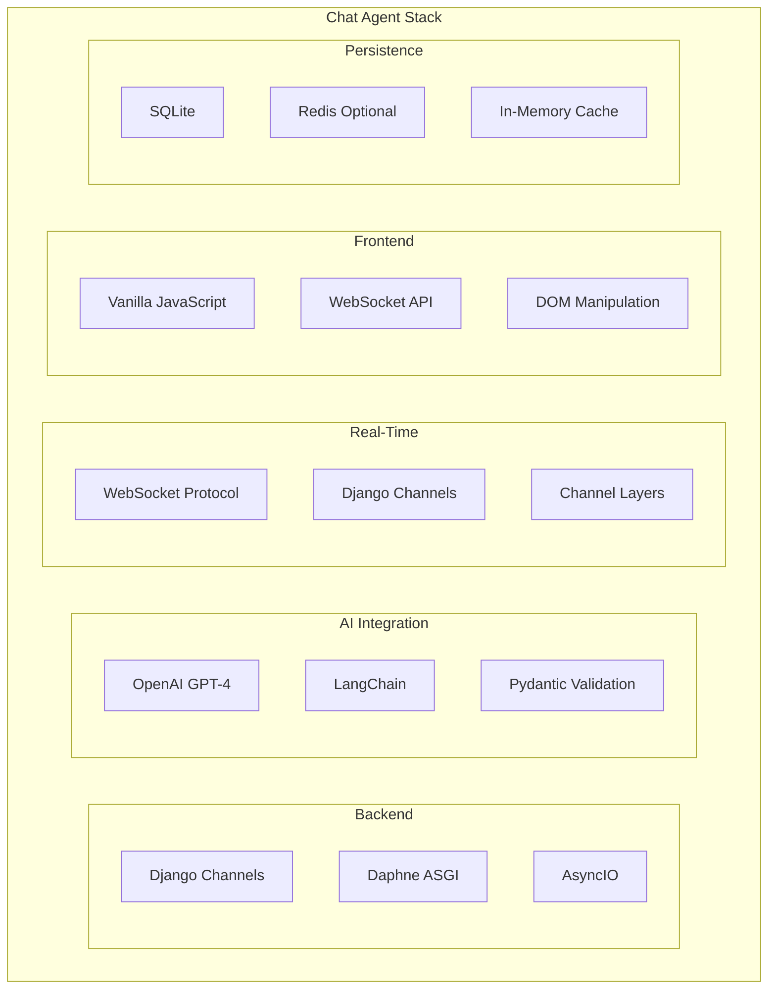

# Chat Agent - Technical Architecture

> **AI-Powered Conversational Interface for Workforce Forecasting**

---

## 1. High-Level Architecture

---

## 2. Message Processing Flow

---

## 3. Intent Classification System

```mermaid
flowchart LR
    subgraph Input["User Input"]
        Msg["User Message"]
    end

    subgraph Preprocess["Preprocessing"]
        Sanitize["Input Sanitization"]
        Spell["Spell Correction"]
        Extract["Entity Extraction"]
        Tag["Message Tagging"]
    end

    subgraph Classify["Intent Classification"]
        LLM["LLM Analysis"]
        Context["Context Aware"]
    end

    subgraph Intents["Intent Categories"]
        Forecast["Get Forecast Data"]
        Reports["List Reports"]
        Roster["Get Roster"]
        ModifyCPH["Modify CPH"]
        ClearCtx["Clear Context"]
        UpdateCtx["Update Filters"]
    end

    subgraph Execute["Execution"]
        Confirm["User Confirmation"]
        Tool["Tool Execution"]
        Response["Generate Response"]
    end

    Msg --> Sanitize
    Sanitize --> Spell
    Spell --> Extract
    Extract --> Tag
    Tag --> LLM
    LLM --> Context
    Context --> Intents
    Intents --> Confirm
    Confirm --> Tool
    Tool --> Response
```

---

## 4. Context Management

---

## 5. WebSocket Communication

---

## 6. Tool Execution Framework

---

## 7. Error Handling

---

## 8. Component Architecture

---

## 9. Data Models

---

## 10. Technology Stack

---

## Key Features

| Feature | Description |
|---------|-------------|
| **Real-Time Chat** | WebSocket-based bidirectional communication |
| **Intent Classification** | LLM-powered understanding of user queries |
| **Context Awareness** | Maintains conversation state across turns |
| **Entity Extraction** | Identifies filters, dates, and parameters |
| **Confirmation Flow** | User confirms before data operations |
| **Auto Reconnect** | Handles connection drops gracefully |
| **Audit Trail** | Logs all tool executions and results |
| **Error Recovery** | User-friendly error messages |

---

## Security Measures

- **Input Sanitization**: XSS, SQL injection, command injection prevention
- **Authentication**: LDAP-integrated user validation
- **WebSocket Auth**: Rejects unauthenticated connections
- **Rate Limiting**: Configurable messages per minute
- **PII Redaction**: User data protected in logs
- **API Key Protection**: Keys never logged or exposed
